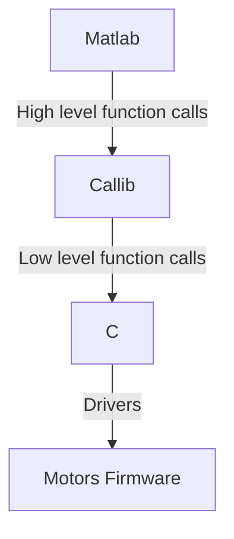
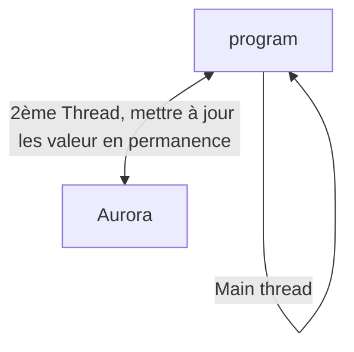

# Introduction

Ce rapport de stage présente mon expérience au sein de l'équipe Gestes Médico-Chirurgicaux Assistés par Ordinateur (GMCAO) du laboratoire TIMC, à l'Université Grenoble Alpes. Ce stage, réservé aux étudiants éligibles au dispositif "stage d'excellence" de l'UGA, s'inscrit dans le cadre du développement de simulateurs numériques pour les robots continus, un domaine innovant et prometteur de la robotique médicale.

L'équipe GMCAO, forte de trois décennies d'activité, est reconnue pour ses avancées dans le développement de dispositifs d'assistance aux gestes médico-chirurgicaux. Elle se distingue par ses recherches en traitement de l'image médicale, fusion de données, modélisation et simulation biomécanique, et robotique médicale, menées en étroite collaboration avec des cliniciens et des spécialistes en méthodologie de l'évaluation clinique.

Le stage que j'ai effectué portait sur la conception d’un simulateur numérique pour robots continus, utilisant l'environnement Matlab. Ces robots, caractérisés par leur structure flexible et leur capacité à réaliser des mouvements tridimensionnels complexes, sont particulièrement adaptés aux applications médicales intracorporelles.

Mon travail consistait à développer des interfaces graphiques dans Matlab permettant de contrôler la vitesse et les mouvements de 16 moteurs, essentiels pour la manipulation de ces robots.

```{.mermaid width=400}
graph TD;
    A[Matlab]-->|Sends commands| B[C shared library];
    B--> |Returns values|A;
```

Mais aussi de lire les mouvements du robot à partir de l'outil Aurora, qui sera expliqué plus en détail ci-dessous.

Ce rapport détaille les différentes étapes de ce projet, les défis rencontrés, ainsi que les compétences techniques et pratiques que j'ai développées au cours de cette expérience enrichissante. Cette opportunité m'a permis de m'immerger dans un environnement pluridisciplinaire dynamique et de contribuer à un projet de recherche expérimental novateur dans le domaine de la robotique médicale.

# Experience

### 1- Matlab

En début de stage, j'ai dû me familiariser avec Matlab, un outil qui signifie Matrix Laboratory, est un environnement de programmation développé par MathWorks. Il est particulièrement apprécié pour ses capacités de manipulation et d'analyse de données, de modélisation et de simulation.

C'est un outil que je n'avais jamais utilisé auparavant. Cette adaptation s'est avérée relativement simple grâce à la syntaxe intuitive de Matlab, comparable à celle de Python. Matlab permet de créer des algorithmes de manière flexible et offre une bibliothèque riche en fonctions et fonctionnalités, facilitant ainsi de nombreuses tâches de programmation.

L'une des fonctionnalités clés de Matlab est son vaste ensemble de bibliothèques pré-intégrées, couvrant divers domaines tels que les mathématiques, les statistiques, le traitement du signal, l'optimisation, et bien plus encore.

Lors de mon stage, j'ai utilisé App Designer, une fonctionnalité de Matlab qui permet de créer des interfaces utilisateur graphiques (GUI) de manière interactive. Cette approche de glisser-déposer (drag and drop) simplifie le développement, permettant d'ajouter facilement des composants comme des boutons, tableaux et graphiques. Grâce à App Designer, j'ai conçu une interface pour contrôler la vitesse et les mouvements des 12 moteurs de notre simulateur de robots continus, facilitant ainsi les tests et ajustements en temps réel.

### 2- C

Lors de mon arrivée, mon encadrant de stage (David BIARE) avait déjà développé des drivers en C pour contrôler les robots.

J'ai donc dû trouver une solution pour connecter ce code C à l'interface Matlab. J'ai opté pour l'utilisation des bibliothèques partagées (shared libraries) de C, qui est supporter par Matlab.

En gros, j'ai créé une bibliothèque partagée contenant le code C des drivers, puis j'ai utilisé la fonction calllib de Matlab pour appeler ces fonctions C directement à partir de Matlab, voir le schema ci dessous, sans passer par les mexFunctions, une méthode plus complexe pour interagir avec le C depuis Matlab.

Une bibliothèque partagée est un fichier qui contient du code compilé et qui peut être utilisé par plusieurs programmes en même temps. Elle permet de séparer le code en modules réutilisables, ce qui simplifie le développement et la maintenance du code. C'était la première fois que le l’utilise.



Comme le montre le schema ci-dessus, matlab parmet d'utiliser calllib pour appeler des fonction de bas niveau du langage C.

Ce fut ma première experience d'interagir et de modifier le code d'un driver. Une experience révélatrice, qui m'as permis d'approfondir mes savoirs au sujet de la compilation et le code machine (tel que vu dans les modules INF401, MAT301 et MAP401).

### 3- Aurora et C++

Apres avoir fait le travail avec Matlab et les drivers en C. Ma tache est devenu de cree une interface pour lire les donnees a partir du systeme aurora, un systeme electronique qui genere un champs magnetique autour de la partie active du robot et qui est pertube par les mouvement de ce derinier, ces perturbations sont convertis en signaux electriques qui sont plus tard interpretés et afficher sur une interface matlab.

#### 4- C++ et POO

C++ est un langage de programmation de bas niveau qui offre un niveau d'abstraction inédit grâce à l'utilisation de la programmation orientée objet (POO).

Pendant mon stage, j'ai eu l'opportunité d'apprendre davantage sur ce langage et d'acquérir une compréhension solide de la POO en général et de son implémentation dans le langage C++.

Le concept des classes m'était déjà familier, mais l'héritage et le polymorphisme étaient nouveaux pour moi.

En plus de la POO, j'ai découvert les design patterns, qui sont des solutions générales réutilisables pour des problèmes courants dans la conception de logiciels. Ils permettent de structurer le code de manière plus efficace et maintenable.

Le design pattern que j'ai utilisé est le singleton. Un singleton est un design pattern qui restreint l'instanciation d'une classe à un seul objet. Cela est utile lorsqu'on a besoin d'exactement un objet pour coordonner des actions dans le système. Voici un exemple de code en C++ pour un singleton :

```c++
class Singleton {
private:
    static Singleton* instance;
    Singleton() {} // Constructeur privé

public:
    static Singleton* getInstance() {
        if (instance == nullptr) {
            instance = new Singleton();
        }
        return instance;
    }
};

// Initialisation du pointeur instance à nullptr
Singleton* Singleton::instance = nullptr;
```

Ceci est example très basique mais ca illustre bien l'idée.

#### Threads

En plus, j'ai exploré le multi-threading. Le multi-threading est une technique qui permet l'exécution concurrente de plusieurs threads (ou processus légers) au sein d'un programme. Cela améliore les performances d'un programme en permettant d'exécuter plusieurs tâches en parallèle.

Pendant le stage j'ai utilise le multi threading pour interagir avec le systeme aurora expliquée ci dessous afin de creer un thread qui mets a jour les valuers en permanance en arriere plan, mais en meme temps ils laisse la main au programmeur d'executer d'autres taches.


